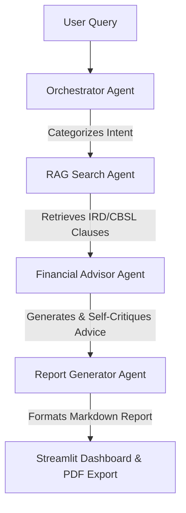

# Sri Lankan SME Business & Tax Advisor (Agentic AI)

[](https://www.python.org/)
[](https://langchain-ai.github.io/langgraph/)
[](https://streamlit.io/)
[](https://www.pinecone.io/)
[](LICENSE)

An enterprise-grade, multi-agent AI application designed to provide Sri Lankan Small and Medium Enterprises (SMEs) with actionable business, regulatory, tax, and financial advisory services. The system utilizes Retrieval-Augmented Generation (RAG) grounded in official regulatory frameworks from the **Inland Revenue Department (IRD)** and the **Central Bank of Sri Lanka (CBSL)**.

---

## Project Description

Sri Lankan Small and Medium Enterprises (SMEs) often struggle to navigate complex regulatory requirements, tax liabilities (such as TIN registration, VAT, and corporate income tax), and government-backed credit lines.

The Sri Lankan SME Business & Tax Advisor is an enterprise-grade, multi-agent AI platform designed to solve this challenge. It provides actionable business, regulatory, tax, and financial advisory services by implementing an Agentic Retrieval-Augmented Generation (RAG) Pipeline. Instead of relying on a single language model, a network of specialized LLM agents collaborate via LangGraph to classify user intent, retrieve verified legal clauses from a cloud vector store, execute self-reflecting financial analysis, and output a formal advisory report grounded in official regulatory frameworks from the Inland Revenue Department (IRD) and the Central Bank of Sri Lanka (CBSL).

---

## Problem Statement
Sri Lankan SMEs often struggle to navigate complex regulatory requirements, tax liabilities (such as TIN registration, VAT, and corporate income tax), and government-backed credit lines. This project addresses this problem by implementing an Agentic RAG Pipeline that utilizes a network of specialized LLM agents to provide verified, grounded advice.

---

## Model Selection Strategy
To balance cost, context window, and raw reasoning capabilities, we evaluated the Llama 3.1 8B Instruct and Llama 3.3 70B Instruct models for the various agents in the pipeline:

| Sub-task | Model (provider) | Why chosen |
| :--- | :--- | :--- |
| Intent routing & classification | Llama 3.1 8B (Groq) | Very low latency, highly cost-effective, and perfectly sufficient for simple intent routing decisions. |
| Deep financial reasoning & final synthesis | Llama 3.3 70B Instruct (OpenRouter) | Higher reasoning quality and self-reflection capabilities justify the higher cost and latency for the final advisory output. |

---

## Multi-Agent Architecture

The core framework is built as a stateful, directed graph where information flows between four domain-specific agents:



### Agent Specifications

| Agent | LLM / Engine | Responsibility |
| :--- | :--- | :--- |
| **Orchestrator Router** | `llama-3.1-8b-instant` (Groq) | Analyzes input intent and categorizes queries into domain buckets (`TAX`, `REGISTRATION`, `LOANS`, `GENERAL`). |
| **RAG Search Agent** | `BAAI/bge-small-en-v1.5` + Pinecone | Performs cosine similarity search over vector embeddings of official IRD and CBSL documents. |
| **Financial Advisor** | `meta-llama/llama-3.3-70b-instruct` (OpenRouter) | Computes tax liabilities and loan eligibility, executing a two-pass **self-critique loop** against regulatory guidelines. |
| **Report Generator** | `meta-llama/llama-3.3-70b-instruct` (OpenRouter) | Synthesizes intermediate agent outputs into a structured, executive Markdown advisory report. |

---

## Explanation of the RAG Pipeline

The Retrieval-Augmented Generation (RAG) pipeline is designed to strictly ground the LLM's outputs in official Sri Lankan regulations to prevent hallucinations.
* Data Ingestion (ETL): Official IRD and CBSL PDF documents are parsed locally.
* Chunking: The text is split into overlapping chunks (1000 characters, 200 overlap) using RecursiveCharacterTextSplitter to maintain contextual boundaries.
* Embedding: The chunks are converted into mathematical vectors using the HuggingFace BAAI/bge-small-en-v1.5 embedding model, generating 384-dimensional vectors.
* Vector Store: These embeddings are uploaded to a Pinecone Serverless Index.
* Retrieval: During runtime, the RAG Search Agent converts the user's query into an embedding and performs a cosine similarity search against the Pinecone index to retrieve the top 4 most relevant regulatory clauses.
* Augmentation: These exact clauses are injected into the context window of the Financial Advisor agent, forcing the model to base its calculations and advice solely on the retrieved laws.

---

## Key Features

* **Grounded Legal Retrieval:** Uses a Serverless Pinecone vector database to ground all advice in verified Sri Lankan statutory texts.
* **Two-Pass Self-Reflection:** The Financial Advisor Agent evaluates its own tax calculation output against IRD policies before final delivery.
* **Automated PDF Export:** Built-in PDF compilation engine (`reportlab`) enabling one-click offline report downloads.
* **Streamlit Interface:** High-contrast dashboard featuring query presets, real-time agent execution status tracking, and theme compatibility.
* **Decoupled Cloud ETL:** Local ETL pipeline (`upload_to_cloud.py`) that pre-processes and vectorizes PDF documents into the cloud, ensuring high runtime availability.

---

## Technology Stack

* **Orchestration:** LangGraph, LangChain Core
* **Language Models:** Groq API (Llama 3.1 8B), OpenRouter API (Llama 3.3 70B Instruct)
* **Vector Database:** Pinecone Serverless Index (`cosine` metric, 384 dimensions)
* **Embeddings:** HuggingFace `BAAI/bge-small-en-v1.5`
* **Frontend:** Streamlit
* **Document Parsing & PDF Export:** PyPDF, ReportLab, Cryptography
* **Environment Management:** Python-Dotenv

---

## Repository Structure

```text
sme-advisor/
├── .env                  # API keys (Excluded from Git)
├── .gitignore            # Security exclusions
├── README.md             # System documentation
├── requirements.txt      # Dependency manifest
├── state.py              # LangGraph SMEState TypedDict definition
├── agents.py             # Agent definitions & vector store initialization
├── graph.py              # LangGraph workflow instantiation & compilation
├── app.py                # Streamlit UI & PDF generation engine
├── upload_to_cloud.py    # One-time ETL pipeline for Pinecone indexing
└── data/
    └── sme_docs/         # Raw IRD & CBSL regulatory PDF files
```

---

## Local Setup & Installation

### 1. Prerequisites
* Python 3.11 or higher
* Git installed
* API Keys for **Groq**, **OpenRouter**, and **Pinecone**

### 2. Clone Repository & Setup Virtual Environment
```bash
git clone https://github.com/nisanganethra/sme-advisor.git
cd sme-advisor

python -m venv venv
# On Windows:
venv\Scriptsctivate
# On macOS/Linux:
source venv/bin/activate
```

### 3. Install Dependencies
```bash
pip install -r requirements.txt
```

### 4. Configure Environment Variables
Create a `.env` file in the root directory:
```env
GROQ_API_KEY=gsk_your_groq_api_key
OPENROUTER_API_KEY=sk-or-v1_your_openrouter_api_key
PINECONE_API_KEY=pcsk_your_pinecone_api_key
```

### 5. Ingest Documents into Pinecone (ETL Step)
Place your regulatory PDFs in `data/sme_docs/` and run the cloud indexing script:
```bash
python upload_to_cloud.py
```

### 6. Launch Application
```bash
streamlit run app.py
```

---

## Deployment (Streamlit Cloud)

1. Push your repository to **GitHub**.
2. Log into [Streamlit Cloud](https://share.streamlit.io/) and create a new application pointing to `app.py`.
3. Under **Advanced Settings -> Secrets**, add your API keys:
   ```toml
   GROQ_API_KEY = "gsk_your_groq_api_key"
   OPENROUTER_API_KEY = "sk-or-v1_your_openrouter_api_key"
   PINECONE_API_KEY = "pcsk_your_pinecone_api_key"
   ```
4. Click **Deploy**.

---

## Git Branching Strategy & Workflow

This project adheres to a modular Feature Branching Strategy with Conventional Commits to maintain a clean project history:

* `main`: Production-ready releases.
* `feature/state-architecture`: Schema and state definitions.
* `feature/data-ingestion`: PDF processing and vector store pipelines.
* `feature/llm-agents`: Core multi-agent logic implementation.
* `feature/graph-workflow`: LangGraph compilation and execution edges.
* `feature/app-interface`: Dashboard development and export options.
* `feature/cloud-vector-migration`: Serverless vector database refactoring.

---

## Live Streamlit Demo Link
https://sme-advisor-pa97kxmqjunbmmg3buw36n.streamlit.app/

---

## Known Limitations
* Encrypted PDFs: Strict government DRM on certain CBSL PDFs blocks the pypdf reader. These must be manually "Printed to PDF" to bypass the encryption before ingestion.
* Cutoff Dates: While the RAG pipeline grounds the model in provided documents, the base Llama models have knowledge cutoffs (e.g., Llama 3.1 8B extends to December 31, 2023). The system relies entirely on the manually updated Pinecone index for current 2026 data.
* Advisory Nature: The generated reports are AI-synthesized estimates and should not replace certified professional accounting or legal counsel in Sri Lanka.

---

## License

This project is open-source under the [MIT License](LICENSE).
